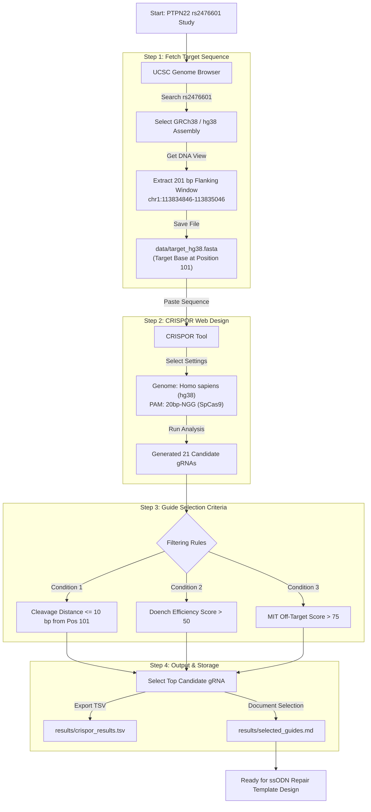

# CRISPR
INTRODUCTION

Clustered regularly interspaced short palindromic repeats (CRISPR)/CRISPR-associated protein 9 (Cas9) gene-editing technology is the ideal tool of the future for treating diseases by permanently correcting deleterious base mutations or disrupting disease-causing genes with great precision and efficiency.The CRISPR/Cas9 system evolved naturally in bacteria and archaea as a defense mechanism against phage infection and plasmid transfer.

The genome editing process using CRISPR-Cas9 unfolds through several steps. Firstly, the CRISPR-Cas9 components are introduced into the target cells, commonly via viral vectors or direct injection. Within the cells, Cas9 and the gRNA form a complex that navigates the genome, seeking the target DNA sequence based on gRNA complementarity . Upon locating the target site, the Cas9 protein triggers a precise double-strand break (DSB) at that locus. DSB repair encompasses two primary pathways: non-homologous end joining (NHEJ) and homology-directed repair (HDR). NHEJ, recognized for its propensity for errors, frequently produces minor insertions or deletions (indels) at the DSB location. In contrast, HDR relies on a template DNA molecule to facilitate accurate modifications.

OBJECTIVE

The Goal is to target PTPN22 (R620W) gene responsible for Rheumatoid arthritis disease by the use of CRISPOR tool.

RHEUMATOID ARTHRITIS

Rheumatoid arthritis (RA) is a common and complex autoimmune disorder in which the immune system erroneously targets the body's own tissues, particularly affecting the joints. This condition is characterized by chronic inflammation that progressively damages synovial joints, leading to pain, swelling, and the destruction of cartilage and bone.A genetic variant particularly a SNP in the gene PTPN22 (R620W, rs2476601) is strongly associated with increased risk for multiple autoimmune diseases and linked to altered TCR regulation and T cell activation. Inparticular, the   R620W variant of   this   protein is associated   with it. This gene was taken for crispr/cas9 editing.

WORKFLOW

UCSC Genome Browser

